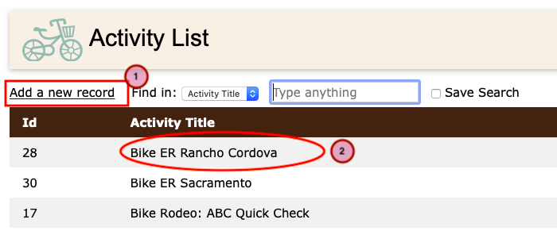
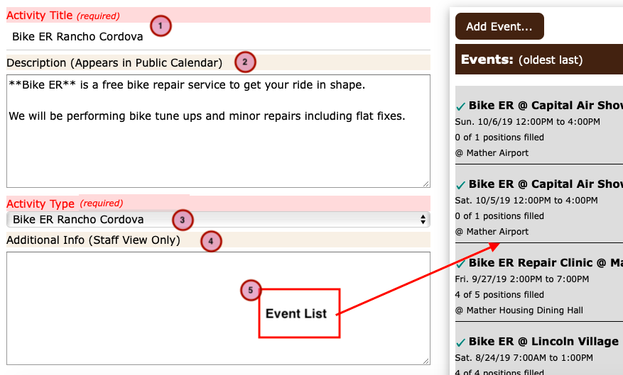

=====================================
How to manage Activity records
=====================================

(Jump to :ref:`activity_instructions`)

All Events are organized within "Activities". The Activity record should be thought of as the goal to be accomplished
during one or more "Events" that are organized under that activity.

For example, an Activity like "Bake Sale" might take place several times during the year, and over the course of a few
years as well. Each "Event" associated with the Activity happens on a specific date. The Activity record provides a way to 
keep the Bake Sale events organized. 

By themselves, Activities have no date or time associated with them and will not appear on your web site calendar. 

Some Strategies
***************

Single Activity
^^^^^^^^^^^^^^^

You must have one Activity record before you can create an Event record, but if you're happy to keep all your events in one
place then you only need one. As you organize more events this may become a bit cumbersome though. You can always create new
Activities later if you wish.

Generic Activities
^^^^^^^^^^^^^^^^^^

You can create a few generic Activity records just to create some general groupings. So for example you might create some
Activities named:

    * Training
    * Parties
    * Clean up Chores
    * ... etc ...
    
Then when you create an Event associated with each of these activities, you can give them more meaningful title for the 
calendar display so visitors to the web site will know what you're talking about.

Very Specific
^^^^^^^^^^^^^

Many organizations will have events that recur annually, monthly, occasionally, what ever. In a case like that you may want
to create an Activity record to group those events together and make them easier to find and update. So, for example, you
might have some Activities like:

     * St. Patrick's Day Run
     * Halloween Bike Ride
     * ... etc ...

The style of organization you use is up to you. It's really just a way to help you manage more or less related events

.. _activity_instructions:

Creating and Editing Activity Records
*************************************

From the main menu, select :guilabel:`Staff Admin -> Activity` to display the Activity List

Activity List
^^^^^^^^^^^^^

    
To create a new Activity record click the "Add a new record" link (1).

To edit an existing Activity record click on one of the items in the list (2).

The Activity Detail page will open.

Activity Detail
^^^^^^^^^^^^^^^

    
The information in the Activity record is used as the default values for some of the fields in the
Event records that are associated with your Activity.

    1. Activity Title: The name of the Activity. This is also the default name that appears in the Calendar view.
    
    2. Description: A public facing description of the Activity. Again, this is the default description for all 
       Events that are associated with this Activity.
    
    3. Activity Type: This is primarily for internal organization and reporting purposes. 
       (The site administrators can create activity types as needed.)
       
    4. Additional Info: This is information that is only displayed to staff members. A good place to put special instructions
       that you'd like to have appear in the roster.
       
    5. Event List: The list of events associated with this Activity. (`More Info on Events <events.html>`_)
       These records represent the actual events that will appear on the calendar.

    

Next steps...
^^^^^^^^^^^^^^^^^^
Now that you have created an Activity, you will probably want to create some `Event records <events.html>`_ that will appear on the Calendar.

