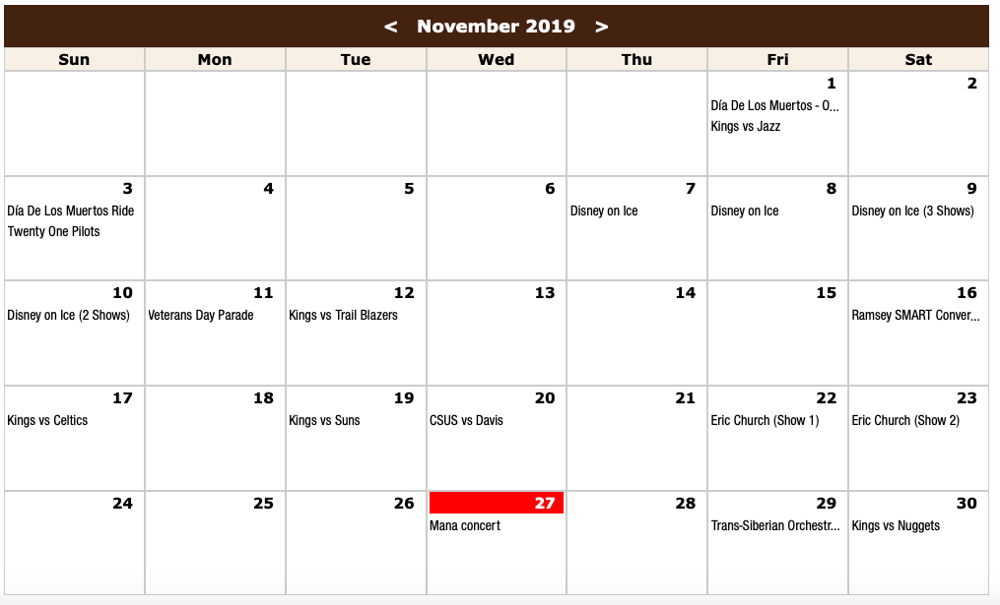
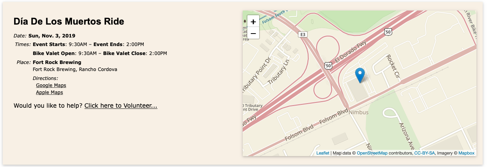
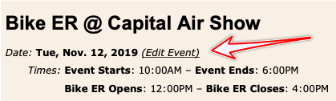

===================
The Calendar
===================

The Calendar page is the default landing page for visitors who come to your web site.

It is meant to be publicly viewable page that people will use to find out about what you're up to.

    
    
When you create an `Event <events.html>`_ record, by default it will appear in your calendar. There is an option to
hide Events is you wish though.

When visitors click on an item in the Calendar they will get more details about the event.

    
Visitors will have the option here to signup to volunteer by clicking a link.

Editing the Event
--------------------

As an administrator, a link to the Event record is included on the page. Clicking the link
will, no suprise, I hope, open the Event record for editing.

