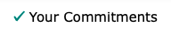
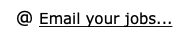

===================
The Calendar
===================

The Calendar page is the default landing page for visitors who come to your web site.

It is meant to be publicly viewable page that people will use to find out about what you're up to.

.. image:: images/calendar/preview.png
    :width: 500px
    
    
When you create an `Event <events.html>`_ record, by default it will appear in your calendar. There is an option to
hide Events is you wish though.

When the visitor is logged in two items appear at the top of the calendar grid:

#. Commitment Indicator:

    
    If the visitor has a commitment to work a job at any of the events listed in the calendar
    a check mark will appear next to the event title.
    
#. Get a commitment list by email:

    
    By clicking the link, the user will receive an email with all of their upcoming commitments.
    The email will include an attachment that can be used to add or update the user's calendar program.
      
When visitors click on an item in the Calendar they will get more details about the event.

.. image:: images/calendar/detail.png
    :width: 500px
    
Visitors will have the option here to signup to volunteer by clicking a link.

Editing the Event
--------------------

As an administrator, a link to the Event record is included on the page. Clicking the link
will, no surprise I hope, open the Event record for editing.

.. image:: images/calendar/edit_event_link.png
    :width: 300px
